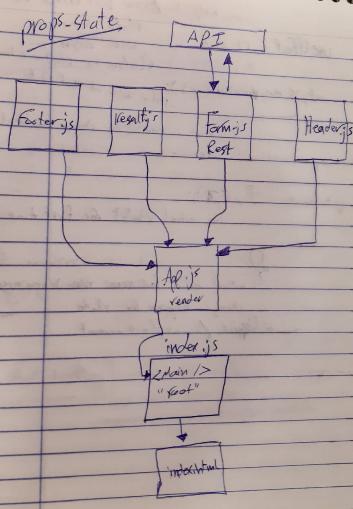

# props-and-state

# LAB - Class 28

### Author: Ahmad Sawalqeh

### Links and Resources

- [submission PR](https://github.com/Ahmad-Sawalqeh/props-and-state/pull/1)
- [Deploy React App](https://ahmad-sawalqeh.github.io/props-and-state/)
- [Javascript Tests](https://github.com/Ahmad-Sawalqeh/props-and-state/runs/478295566?check_suite_focus=true)

### Setup
How to initialize/run your application (where applicable)
* npm run start

#### Tests

- How do you run tests?
`npm test`
- Describe any tests that you did not complete, skipped, etc

# UML

